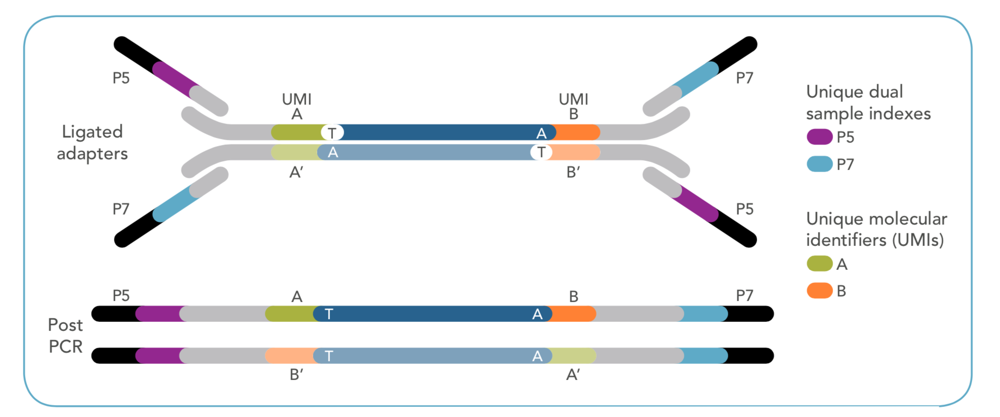

ctDNA tumor only analysis pipeline.

https://github.com/fanyucai1/bio_docker

https://hub.docker.com/r/fanyucai1/ctdna_tumor_only

Table of Contents
=================

* [Table of Contents](#table-of-contents)
  * [library](#library)
  * [content](#content)
  * [loading local database](#loading-local-database)
  * [Data I shared](#data-i-shared)
  * [run pipeline](#run-pipeline)
    * [prepare](#prepare)
    * [run shell](#run-shell)
    * [usage](#usage)

## library
Paired UMI reads is 3bp respectively，others 2bp as linker. 
library as follows:

## content
SNV(vardict),CNV(CNVkit),fusion(genefuse)

## loading local database

        /data/Database
        ├── Annovar
        │   ├── annotate_variation.pl
        │   ├── coding_change.pl
        │   ├── convert2annovar.pl
        │   ├── humandb
        │   │   ├── genometrax-sample-files-gff
        │   │   ├── GRCh37_MT_ensGeneMrna.fa
        │   │   ├── GRCh37_MT_ensGene.txt
        │   │   ├── hg19_1000g2015aug.zip
        │   │   ├── hg19_AFR.sites.2015_08.txt
        │   │   ├── hg19_AFR.sites.2015_08.txt.idx
        │   │   ├── hg19_ALL.sites.2015_08.txt
        │   │   ├── hg19_ALL.sites.2015_08.txt.idx
        │   │   ├── hg19_AMR.sites.2015_08.txt
        │   │   ├── hg19_AMR.sites.2015_08.txt.idx
        │   │   ├── hg19_avsnp150.txt
        │   │   ├── hg19_avsnp150.txt.idx
        │   │   ├── hg19_cadd13gt20.txt
        │   │   ├── hg19_cadd13gt20.txt.idx
        │   │   ├── hg19_clinvar_20190305.txt
        │   │   ├── hg19_clinvar_20190305.txt.idx
        │   │   ├── hg19_cosmic88_coding.txt
        │   │   ├── hg19_cosmic88_coding.txt.idx
        │   │   ├── hg19_cosmic88_noncoding.txt
        │   │   ├── hg19_cosmic88_noncoding.txt.idx
        │   │   ├── hg19_cytoBand.txt
        │   │   ├── hg19_dbnsfp31a_interpro.txt.idx
        │   │   ├── hg19_dbnsfp35c.txt.idx
        │   │   ├── hg19_dbscsnv11.txt.idx
        │   │   ├── hg19_EAS.sites.2015_08.txt
        │   │   ├── hg19_EAS.sites.2015_08.txt.idx
        │   │   ├── hg19_esp6500siv2_all.txt
        │   │   ├── hg19_esp6500siv2_all.txt.idx
        │   │   ├── hg19_EUR.sites.2015_08.txt
        │   │   ├── hg19_EUR.sites.2015_08.txt.idx
        │   │   ├── hg19_exac03nonpsych.txt.idx
        │   │   ├── hg19_exac03.txt
        │   │   ├── hg19_exac03.txt.idx
        │   │   ├── hg19_example_db_generic.txt
        │   │   ├── hg19_example_db_gff3.txt
        │   │   ├── hg19_gerp++gt2.txt.idx
        │   │   ├── hg19_gnomad211_exome.txt
        │   │   ├── hg19_gnomad211_exome.txt.idx
        │   │   ├── hg19_gnomad211_genome.txt
        │   │   ├── hg19_gnomad211_genome.txt.idx
        │   │   ├── hg19_gwasCatalog.txt
        │   │   ├── hg19_intervar_20180118.txt
        │   │   ├── hg19_intervar_20180118.txt.idx
        │   │   ├── hg19_ljb26_all.txt
        │   │   ├── hg19_ljb26_all.txt.idx
        │   │   ├── hg19_MT_ensGeneMrna.fa
        │   │   ├── hg19_MT_ensGene.txt
        │   │   ├── hg19_refGeneMrna.fa
        │   │   ├── hg19_refGene.txt
        │   │   ├── hg19_refGeneVersion.txt
        │   │   ├── hg19_refGeneWithVerMrna.fa
        │   │   ├── hg19_refGeneWithVer.txt
        │   │   ├── hg19_rmsk.txt
        │   │   ├── hg19_SAS.sites.2015_08.txt
        │   │   ├── hg19_SAS.sites.2015_08.txt.idx
        │   │   ├── hg19_snp138.txt
        │   │   ├── hg19_snp138.txt.idx
        │   │   ├── hg19_targetScanS.txt
        │   │   └── hg19_wgRna.txt
        │   ├── index_annovar.pl
        │   ├── prepare_annovar_user.pl
        │   ├── retrieve_seq_from_fasta.pl
        │   ├── table_annovar.pl
        │   └── variants_reduction.pl
        ├── CNV_baseline
        │   └── 27ctDNA
        │       ├── AC19CF019P.recal.bai
        │       ├── AC19CF019P.recal.bam
        │       ├── AC19CF019P.recal.bam.bai
        │       ├── AC19CF020P.recal.bai
        │       ├── AC19CF020P.recal.bam
        │       ├── AC19CF020P.recal.bam.bai
        │       ├── AC19CF021P.recal.bai
        │       ├── AC19CF021P.recal.bam
        │       ├── AC19CF021P.recal.bam.bai
        │       ├── AC19CF022P.recal.bai
        │       ├── AC19CF022P.recal.bam
        │       ├── AC19CF022P.recal.bam.bai
        │       ├── AC19CF023P.recal.bai
        │       ├── AC19CF023P.recal.bam
        │       ├── AC19CF023P.recal.bam.bai
        │       ├── AC19CF024P.recal.bai
        │       ├── AC19CF024P.recal.bam
        │       ├── AC19CF024P.recal.bam.bai
        │       ├── AC19CF025P.recal.bai
        │       ├── AC19CF025P.recal.bam
        │       ├── AC19CF025P.recal.bam.bai
        │       ├── AC19CF026P.recal.bai
        │       ├── AC19CF026P.recal.bam
        │       ├── AC19CF026P.recal.bam.bai
        │       ├── AC19CF027P.recal.bai
        │       ├── AC19CF027P.recal.bam
        │       ├── AC19CF027P.recal.bam.bai
        │       ├── AC19CF028P.recal.bai
        │       ├── AC19CF028P.recal.bam
        │       └── AC19CF028P.recal.bam.bai
        ├── COSMIC
        │   └── release_v88
        │       ├── compileAnnnovarIndex.pl
        │       ├── CosmicCodingMuts.hg19.vcf
        │       ├── CosmicCodingMuts.hg19.vcf.idx
        │       ├── CosmicCodingMuts.vcf
        │       ├── CosmicMutantExport.tsv
        │       ├── CosmicNCV.tsv
        │       ├── CosmicNonCodingVariants.vcf
        │       ├── GRCh37_cosmic88_coding.txt
        │       ├── GRCh37_cosmic88_noncoding.txt
        │       ├── index_annovar.pl
        │       ├── prepare_annovar_user.pl
        │       └── unmapped.vcf
        ├── hg19
        │   ├── ucsc.hg19.dict
        │   ├── ucsc.hg19.fasta
        │   ├── ucsc.hg19.fasta.amb
        │   ├── ucsc.hg19.fasta.ann
        │   ├── ucsc.hg19.fasta.bwt
        │   ├── ucsc.hg19.fasta.fai
        │   ├── ucsc.hg19.fasta.pac
        │   └── ucsc.hg19.fasta.sa
        ├── knownCanonical
        │   └── clinvar_canonical_trans.txt

## Data I shared
https://drive.google.com/drive/folders/17-MpN0x4Z2kw7RFJnbY3KQUgPA3tN0fJ?usp=sharing

##  run pipeline

### prepare

    1.  Assuming fastq data:/data/test_data/(input)
                                             ----vs-----/project/(docker)
    
    2.  Copy your bed file to outdir: /data/test_data/outdir(input)
                                                             ----vs-----/result/(docker)
    
    3.  reference:/data/Databse(input)
                                ----vs-----/data/Databse(docker)

### run shell

    docker run -i -v /data/test_data/:/project/ -v /data/:/data/ \
    -v /data/test_data/outdir:/result/ fanyucai1/ctdna_tumor_only:latest \
    python3 /script/main_process.py LC190082P_S2_1.fq.gz LC190082P_S2_2.fq.gz panel_27.bed 151 LC190082P 0.001
    
### usage

    pe1 = sys.argv[1]
    pe2 = sys.argv[2]
    bed = sys.argv[3]
    read_length = sys.argv[4]
    prefix = sys.argv[5]
    vaf=0.001

### output 

        /data/test_data/outdir
        ├── anno
        │   ├── LC190082P.annovar.filter.tsv
        │   ├── LC190082P.annovar.tsv
        │   └── LC190082P.vcf
        ├── bam
        │   ├── LC190082P.consensus.filter.clipped.bai
        │   └── LC190082P.consensus.filter.clipped.bam
        ├── cnv
        │   ├── cnv.final.tsv
        │   ├── panel_27.antitarget.bed
        │   └── panel_27.target.bed
        ├── genefuse
        │   ├── LC190082P.result
        │   └── LC190082P.tsv
        ├── panel_27.bed
        ├── qc
        │   └── LC190082P.sample.qc.tsv
        └── snv
            └── LC190082P.vardict.vcf